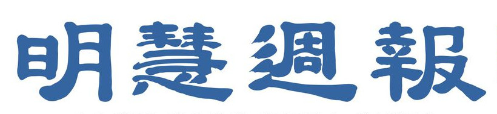
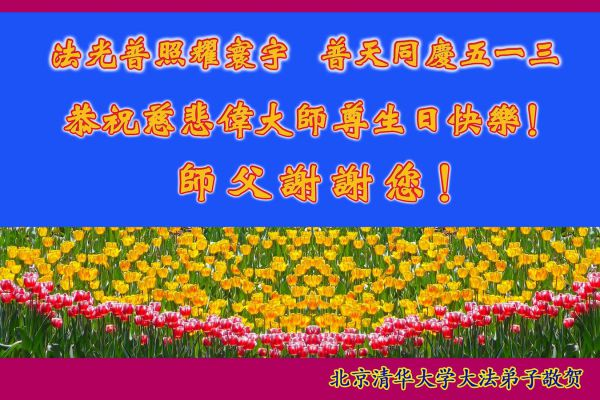
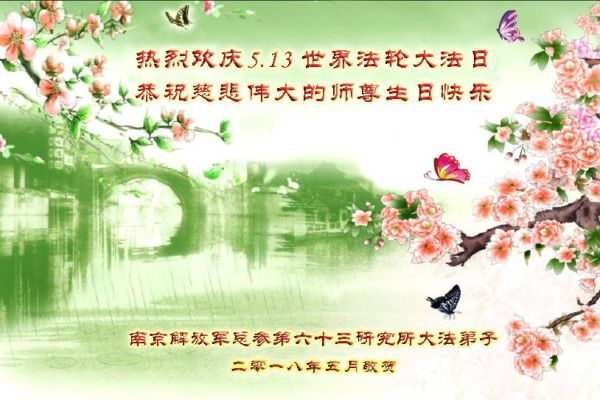
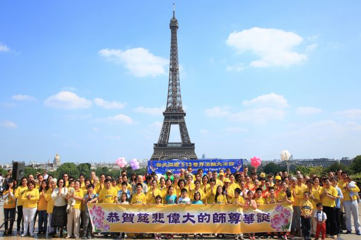
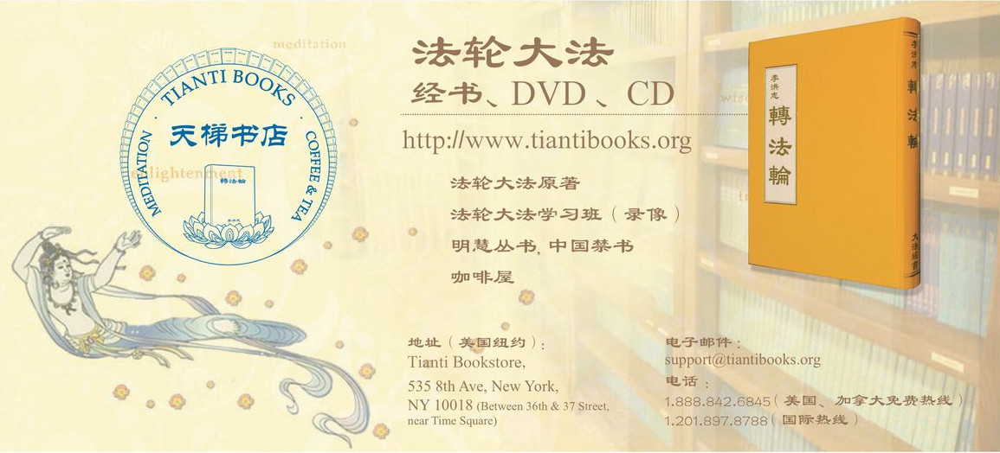
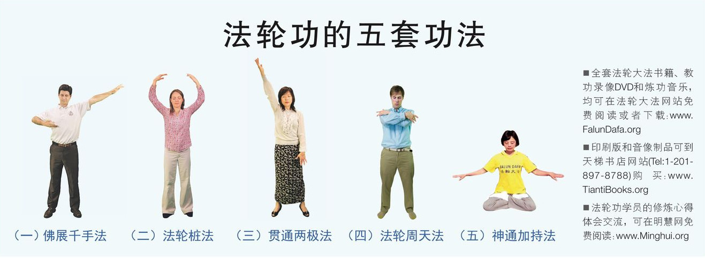
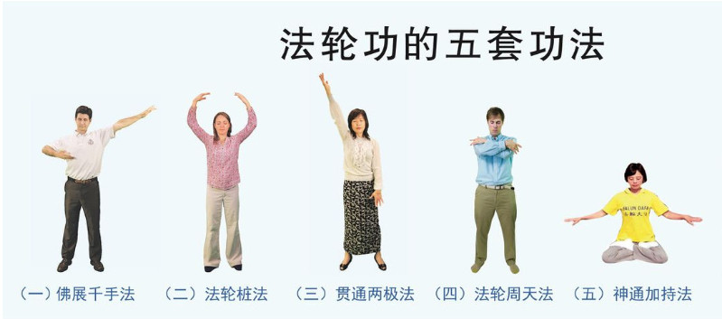

<h3>人生莫测 多少迷蒙 真相明心 缘到福成</h3>

<h3>感恩之心化飞鸿 大法弟子敬谢师尊指引生命归航</h3>

（明慧记者夏纯清综合报道）1992年5月13日，法轮大法创始人李洪志大师在吉林长春公开传授高德大法，由此开启了一幕意义非凡的历史大戏。26年来，“真、善、忍”的光芒，照耀全球。李洪志大师的教导，让上亿各国各族裔法轮功学员身心升华，也归正了世道人心，重建道德。

每年的“5.13”，李洪志大师的华诞暨“世界法轮大法日”，全球各大城市都会举行隆重庆典，各国弟子和明白真相的民众通过明慧网献给师尊数以万计的贺卡、贺辞。“感恩之心化飞鸿”，这些来自五洲四海、如潮水般汇聚的贺卡、贺辞，展现最深挚的感恩与喜悦，敬谢师尊指引生命的归航，也表达了对师父的思念与坚修大法的决心。

<b>感恩师尊开示人生真谛</b>

辽宁辽阳一位大法弟子说：“师父您好，在这普天同庆的日子，我想对师父说我的心里话。在我很小的时候，我就常常觉的这里不是我的家，我来到这里，是要寻找什么。可是一直不知道自己要寻找的到底是什么。直到有一天，我看到了这本天书——《转法轮》，我在内心深处反复的呼喊：我找到了！我找到了！我终于明白我这一生是干什么来了！那就是：找到师父，洗净自己，修好自己，救度众生，然后，跟师父回家！虽然身在俗世，并且也沾染了许多肮脏的东西，但是，我不会忘记来世的目的，我一定要奋力精進，做师父的合格弟子。”

湖北十堰市某农村地区全家三口人表示：“弟子得法快20年，得到师尊无数次的保护才走到今天，弟子从修炼前的多病变强壮，坏思想满身变的道德高尚，脱胎换骨的变化都是因师尊传真、善、忍改变了我们，千言万语汇成一句话：信仰真善忍，永不退缩。”

江西九江地区各市县全体大法弟子表示：“在以后的日子里，无论邪恶怎样猖狂、形势多么严峻，都动摇不了得了大法的生命，最正的信念走完师尊安排的修炼路，完成历史赋予的庄严神圣使命，不负师尊的慈悲救度。”

<b>世人明真相</b>

数以万计的贺卡和贺词中，有不少是来自明白了真相的世人和大法弟子的家属们，他们借此大法洪传26周年之际，向李洪志大师献上最崇高的敬意。

湖南省长沙市大法弟子家属在贺词中表示：“师尊华诞快乐！祝全世界大法弟子5.13大法日快乐！我和媳妇，儿子暂未修炼，但是我们对李洪志大师尊敬和感恩，所以我们敬称师尊，我们经常念法轮大法好，真善忍好。

“师尊保护我们全家人。有一次大汽车追尾，把我开的小车后备箱，后排座都压扁了，是您保护我们平安。再一次叩拜师尊的大恩大德，我们支持母亲修炼法轮大法，支持全世界大法弟子，尊敬师尊，尊敬法轮大法。” 

重庆市沙坪坝区明真相的世人一家恭祝李大师生日快乐，他们说：“感谢李大师对我们全家的恩赐，得了一个天真活泼的小宝贝，我们永远记住法轮大法好！真、善、忍好。”

<h3>巴黎人权广场庆大法日 民众喜闻法轮功</h3>

文：法国法轮功学员
 
2018年5月13日是法轮大法日，标志着法轮大法弘传26周年，同时也是法轮功创始人李洪志先生67岁华诞。
 
5月20日在法国巴黎铁塔对面的人权广场上，法国法轮功学员们用歌舞演出和功法演示向过往的游客和法国民众传递大法的美好，同时也告诉人们正在中国发生的对大法修炼者的迫害，呼吁制止迫害。

星期日的人权广场上各个民族和肤色的游客熙熙攘攘，人们被时而喜庆欢快，时而柔和优美的音乐、舞蹈吸引过来，那些年龄不等、中西方各族裔面孔的修炼人表演的功法更是让他们陷入了思考。

莱奥波尔迪娜·博都（Leopoldine Boto）女士是一名教师，在大学和中学教授法国文学。她看了很久，她说法轮功是能“让人的灵魂和身体都能觉醒的功法”，却在中国遭到中共的打压，“他们在这里演示给公众，我认为是一个很好的做法，特别是在铁塔下，和大家分享，让我们知道了这样的信息，我称赞他们，还要谢谢他们。”

在围观的人中，有一对在法国工作的土耳其籍夫妇，先生叫合西（JOSE ARUGO），夫妇都感到这个功法让人感觉很舒服，尤其是在法国能有机会了解和看到另外一种文化很好，他们对中共对此功法的镇压行为感到不能接受。明白真相后他们说，这就明白了，中共邪恶本性怎么会让人们自由思考呢！

摄影师穆斯塔法·赛福吉（MUSTAFA SEVGI）先生整个下午都在观看法轮功学员演出的节目和功法展示，他为法国一家著名摄影杂志工作，今天拍的这些照片会推荐给杂志社。他说：“这是我第一次了解法轮大法，让人神清气爽。”这么好的功法中共政权却以镇压来对待，这种罪恶必须立即停止。

在蓝天白云和铁塔的背景下，法轮功学员们合照并齐声喊出：“恭祝师尊生日快乐！ 法轮大法好！ 真善忍好！”令人感动的是，在后排有两位从德国来的年轻游客也双手合十，问法轮功学员他们可不可以跟着一起照相，得到同意之后就一直在后面站着，跟法轮功学员们合影后才高兴的离去。

<h2>2 海外之窗</h2>

