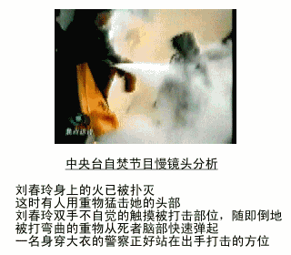

<table>
  <tr>
   <td>2001年，在中国大地上，中共对法轮功的迫害正腥风血雨般地展开着。当年的1月23日，在这个家家团圆的除夕夜，天安门广场发生了震惊世界的“自焚”案。中共官方在第一时间宣称事件是法轮功学员所为。虽然各项证据都表明，事件是中共的“自编自演”，但中央电视台等官媒铺天盖地的报导，挑起了民众对法轮功的仇恨情绪。 
    据人权团体自由之家统计，事件发生后，法轮功学员受到更为严厉的监禁和酷刑，被拘押的法轮功学员在拘押期间死亡人数明显上升，法轮功学员在中国陷入极其艰难的境地。</td>
  </tr>
  </table>

