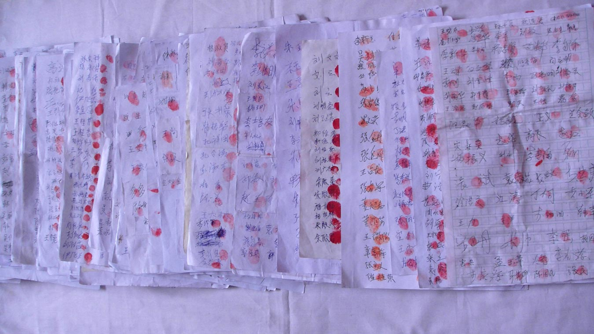

<table>
  <tr>
   <td>
     

   <h3>■ 2001年，在中国大地上，中共对法轮功的迫害正腥风血雨般地展开着。当年的1月23日，在这个家家团圆的除夕夜，天安门广场发生了震惊世界的“自焚”案。中共官方在第一时间宣称事件是法轮功学员所为。虽然各项证据都表明，事件是中共的“自编自演”，但中央电视台等官媒铺天盖地的报导，挑起了民众对法轮功的仇恨情绪。</h3>
     

   <h3> ■ 据人权团体自由之家统计，事件发生后，法轮功学员受到更为严厉的监禁和酷刑，被拘押的法轮功学员在拘押期间死亡人数明显上升，法轮功学员在中国陷入极其艰难的境地。</h3> 

 <h3>   ■ 十几年来，随着越来越多民间质疑的涌现和相关调查结果的曝光，所谓的〝自焚〞真相渐渐被揭开，成为公认的〝21世纪最大伪案〞。</h3>
     

  <h3> ■《追查国际》发言人汪志远指出，多项调查证据表明，〝天安门自焚伪案〞，是中共江泽民当局策划的构陷法轮功的阴谋。</h3>
        
      
   </td>
  </tr>
  </table>
 
 <h2 align=center><a href="https://git.io/waaa">下面请看来自各方对事件疑点的分析汇总。</a></h2>
 
 <table> 
<tr><td> ◆ 为什么自焚者王进东面容烧毁，头发和装满汽油的塑料瓶却完好无损？ </tr></td>
 <tr><td>◆ 大量警察和急救车是如何在短短几分钟内赶到现场的？ </tr></td>
<tr><td>◆ 警察手中的十多个大型灭火器和〝灭火毯〞从哪里来？ </tr></td>
<tr><td>◆ 为什么要等自焚者喊完口号再盖上〝灭火毯〞？ </tr></td>
 <tr><td>◆ 令摄影专业人士关心的是，如此突发、短暂的焚烧镜头，是怎样被及时而又清晰拍下的？不但近景、远景和特写具全，自焚画面还能跟随事件发展。 </tr></td>
<tr><td>◆ 刘思影的母亲刘春玲的死亡，也被舆论质疑是遭重击打死而不是烧死。 </tr></td>
<tr><td>◆ 12岁小女孩刘思影，做了气管切开，居然还能发出这么清脆的声音，还唱歌。不符合医学常识。(做气管切开发声是非常困难的) </tr></td>
<tr><td>◆刘思影，大面积烧伤，身体裹得紧紧的，不符合医学常识。
(大面积烧伤病人，她的创面，要尽量的暴露，因为裹得太严实了，护士换药、清创非常的麻烦而且很容易造成创面的化脓感染。) </tr></td>
 <tr><td>◆ 摄影机跟踪拍摄整个过程,从画面上看,拍摄自焚现场的镜头是从高处拍摄的,镜头是移动,跟踪拍摄整个事件。这说明整个过程是事先安排好的。 </tr></td>

  </table>
 

 
 

 

  

 

         

2002年1月，北美中文电视台“新唐人”制作了揭露“天安门自焚”真相的影片《伪火》（False Fire），该片从各国参赛的600多部影片中脱颖而出，于2003年11月8日获得第51届哥伦布国际电影电视节荣誉奖，该纪录片揭开了“自焚案”部分漏洞。（大纪元资料室）

 

 
 

 

 

<h2 align=center> <a href="https://git.io/ykkk"> ■ 气管切开还能唱歌 明显违反医学常识</a></h2>

12岁的小姑娘刘思影全身烧伤面积达40%，头、面部四度烧伤，双眼睑外翻，呼吸困难，颜面、双手基本毁损。然而，身受如此重伤的刘思影却仍然能在新华社的报导里与记者对白。中央电视台“天安门自焚案”中的“烧伤病人”全身包裹，记者不穿卫生服，不戴口罩，大胆采访。明显违反医学常识。气管切开手术后，人是绝不可能在这么短时间里恢复讲话能力的。大面积烧伤病人，她的创面，要尽量的暴露，因为裹得太严实了，护士换药、清创非常的麻烦而且很容易造成创面的化脓感染。（视频截图）

 

 

 

 <h2 align=center> <a href="https://git.io/ykkk"> ■ 衣服烧烂，头发却耐火？人被严重烧伤了 雪碧瓶却完好无损</a></h2>

警察晃着灭火毯等镜头，棉衣裤子烧烂，头发还完好，火烧后盛着汽油的塑料瓶完好翠绿。央视女记者承认自焚“摆拍”。

 
 

天安门自焚伪案中在王进东自焚时，警察拿着所谓的“灭火毯”，却垂在王进东的身后，垂在下面，是在做戏，不是在救“火”。（视频截图）

 

 

  <h2 align=center> <a href="https://git.io/ykkk">■ 天安门警察背着灭火器巡逻？</a></h2>
 

 
澳洲《时代报》（The Age）2004年10月16日的报道对央视的自焚录像做出强烈质疑：“警方事先不知情，却在90秒内，携带大量消防设备出现在画面中。”

  

 

  <h2 align=center> <a href="https://git.io/ykkk">■ 谁是画面外的摄影师？</a></h2>
 

 
图中的男子在军警间从容拍摄。国际社会质疑：央视自焚录像有远景、移动拍摄的近景，还有多个自焚者在不同位置的特写，并且录下了声音，显然摄影师做好了准备才能做到的专业拍摄。

  

  

 <h2 align=center> <a href="https://git.io/ykkk"> ■ 女主角被当场灭口？</a></h2>

 
让录像说话：假冒法轮功学员自焚的刘春铃被不明人士当场灭口

从中央电视台《焦点访谈》节目中关于自焚的现场录像可以看到，有一名身穿大衣的男子手持一重物，用力向死者刘春玲的头部击打，导致刘春玲急速倒地，并用手护卫被打的左侧头部。追查国际有理由认为刘春玲极有可能是在现场被打死，而非被烧死。现场这一名身穿军大衣的男子很明显不是在参与救人，而是要置刘春玲于死地！

 
 

 <h2 align=center> <a href="https://git.io/ykkk"> ■ 自焚的王进东是法轮功学员吗？</a></h2>

 
自称“老学员”的王进东竟然不会双盘腿。

 

 
王进东的大拇指不是法轮功的正确动作——指尖轻轻接触，而是错误的上下重叠。

 

 <table>
  <tr>
 <td> 

</td>
 <td><h3><a href="https://github.com/sodore/dsdsa/blob/master/video/OwQA4tZUShUeb.mp4?raw=true">请观看录像：追查国际“天安门自焚疑案”调查纪实 .mp4 下載</a></h3>
</td>

</tr>
</table>

 <h2 align="center">
<a href="https://git.io/waaa">法轮功明确指出：炼功人不能杀生，自杀有罪</a>
</h2>         
■ 法轮修炼大法是由李洪志先生创编的佛家上乘修炼大法。在李洪志大师的著作《转法轮》中明确指出：“炼功人不能杀生”，李洪志先生还在 《悉尼法会讲法》中指出：“自杀是有罪的。” 真正的法轮功学员不会去自焚。

【明慧网二零一四年一月七日】（明慧评论员文章）法轮功是上乘佛家修炼大法，明文禁止杀生和自杀。任何以自杀、杀生行为诬陷、诋毁法轮功的人，都不敢让人系统地、不带任何观念地、静心地阅读法轮功原著，特别是《转法轮》一书，也不敢让人亲身体验法轮功的功法，因为坏人也知道：很多人都是有良知的，看见真相就不愿再相信谎言。
为了各位的前程，希望大家都来看《是自焚还是骗局》这个十三分钟的录像短片，即便是在百忙之中，很值得看，不看以后可能会非常遗憾！如果能静心通读《转法轮》一书，就更好。

中共就是中共，本性绝不会改变，就如同狼绝不会变成狗或者羊。十三年前的“天安门自焚”骗局虽然早已被揭穿，但命令烧书、禁书的那些中共罪人，总是在寻找欺骗更多人的机会，想多拉一些人陪绑，其中包括海外出于各种目的想和中共走近的人，并借此延缓中共被治罪的那一天的到来。

历史上对正信的迫害从来就没有成功过，现在中共对法轮功“真善忍”真理的迫害更是从一开始就注定了失败。从1999年7月至2014年1月，这场对法轮功的政治迫害已持续十五年了，法轮功学员在中国大陆和平、理性的反迫害言行，通过海外明慧网对迫害黑幕的揭露，也持续十五年了，迫害行为赖以藏身的主要场所——劳教所已经解体，迫害走入末路之末。在这种情况下，又有人到海外拿自焚骗局作招牌，象开假面舞会似的演戏，这一次，目的是骗谁呢？

自焚真相是本世纪重大信息。知道才能心明眼亮，明白才有未来、有光明、有希望。

相关历史概要：

1）法轮功是佛家上乘修炼大法，以《转法轮》一书教人按“真善忍”做好人、提高道德境界，并辅以五套动作优美缓慢的功法。从1992年5月公开传出，至1999年7月，短短七年间，学炼法轮功的人数已高达一亿；因祛病健身、回升社会道德的显著功效，法轮功在中国的声誉家喻户晓。

2）1999年6月，中共专门为迫害法轮功而成立了权力凌驾于公检法之上的“610办公室”。

3）1999年7月，中共首恶江泽民、罗干出于妒嫉和个人利益，发动了对法轮功的全面迫害。但当时，中国大陆有太多的人都经历过“文化大革命”，也都知道法轮功的功效，所以对这场政治迫害不以为然，对政府发动的“百万签名声讨法轮功”等活动消极对待。同时，大批法轮功学员自发地走向北京信访办、天安门广场，为法轮功说公道话。

4）江泽民发布的密令中，最臭名昭著的是对法轮功“名誉上搞臭，经济上截断，肉体上消灭”、“往死里打，打死算自杀”、“打死不查身源，直接火化”。

5）为维持和广泛推动这场迫害法轮功运动，2001年1月23日，江泽民、罗干之流，在天安门广场推出了一场自导自演的自焚事件，并动用全中国的媒体，用这场伤天害理、残害生命的黑戏，嫁祸法轮功。

6）“天安门自焚”骗局推出一周后，人们疑问重重。于是中共操控中央电视台，推出了一个以自焚为题的“焦点访谈”节目，攻击法轮功。然而通过对“焦点访谈”的录像进行慢镜头播放和分析，人们却发现了更多的漏洞。比如，在这场事件中当场失去性命的刘春玲，不象被焚烧致死，而是被突然来自脑后的重物击打致死，而神秘的击打者是军警模样。中央电视台的自焚画面中还有王进东的现场大特写，一名警察站在他的身边，拿着灭火毯，悠闲地等着王进东喊口号，然后机械地把灭火毯盖在王的头上。“王进东”浑身衣服被烧得七零八落，可是他两腿中间装汽油的绿色塑料雪碧瓶却完好无损。

7）法轮功是佛法修炼，禁止杀生和自杀。1995年出版的法轮功主要著作《转法轮》〈第七讲〉中专门有“杀生问题”一节，其中写道：“杀生这个问题很敏感，对炼功人来说，我们要求也比较严格，炼功人不能杀生。”1996年法轮功创始人李洪志先生在《悉尼法会讲法》时，当有弟子问，“杀生是一种很大的罪业，一个人他自杀算不算罪呢？”李先生回答：“算罪。……所以自杀是有罪的。”

8）尽管江罗监制的自焚事件漏洞百出，但想在政治上捞票的人，常年将此伪案和骗人用的“标准答案”塞入中国大陆中小学校的教科书、考试题、招工表格，从儿童、青少年学生做起，制造对法轮功的恐惧和仇恨。

<h2 align="center"><a href="https://git.io/ykkk">自焚伪案：原来不止是演戏，真的在杀人放火</a></h2>    

【明慧网二零一二年三月二十八日】因为要保护这位讲真话的世人，所以称之为贾姐，贾姐当时是某市团委的负责人，二零零一年罗干导演天安门自焚，栽赃构陷法轮功时，在摆道具的时候，正式拍摄前，她在天安门现场。

她说：当时看到一伙人忙忙活活的，还以为是拍电视。她没有在意就离开了，离京前并不知道发生了什么事。直到正月初八，全国铺天盖地的播放自焚伪案，挑动仇恨时，她才明白过来：原来不止是演戏，真的在杀人放火。

几年后遇到修炼法轮功的同学向其讲述真相时，她说出来的，而且说：她不会相信造谣的谎言，因为她亲眼看到了。

<h2 align="center"><a href="https://git.io/ykkk">刘春玲邻居揭露自焚伪案</a></h2>  
【明慧网2006年5月16日】我是一个女大法弟子，2006年5月12日，我去开封谈生意，对方也是位女士，自然说话随便多了。一会儿，我将话题转到了讲真相上，当说到“天安门自焚伪案”时，没想到对方竟然和那个被打死的刘春玲是近门邻居，她滔滔不绝的向我讲了刘春玲的一些情况和生活中的行为。

她说：“刘春玲是外地人，和丈夫离婚后带着母亲（继母）和女儿思影到开封生活，平常打工或者干些零活挣钱维持，生活很拮据。由于感情和生活上的压力，她脾气时好时坏，发作时常常打骂思影发泄。邻居们既可怜她一家，更可怜那受苦的孩子。有一次，是夏天，春玲又发脾气打孩子，毒辣辣的太阳她竟然罚思影到院里暴晒，我当时看不过，就拉着思影说，回屋里去吧，你妈妈不打你了。可是没有春玲允许，思影还是傻傻的在太阳下不敢回屋。”

“后来，几天不见她母女，电视里却说她们去天安门自焚了，而且还是个炼法轮功的，真是可笑，我和春玲住那么近，一天不知要见多少次面，从来没有见过、也没有听说过她炼法轮功，那时候法轮功在我们开封几乎是家喻户晓，我们苹果园区就有，那些老太太大清早的听着录音机炼功，路旁都有，却从没有见春玲去炼。再说了，春玲当时生活都顾不着了，哪有闲心去炼功啊。所以这个什么自焚在我们那个居住区都知道是假的，春玲是被人骗了，被人害了，真可怜。”

“还有一件事更让人怀疑，大概是自焚后的几天（记不清了），警察去春玲家搜查，我和那几家邻居都在场，大家都很惊奇的是，警察从春玲屋里搜出了十多万现金（估计），都是壹佰元成捆的。在场的邻居都议论纷纷，春玲这么穷，哪来那么多钱，平常吃穿都俭省的很，居然在家里放了这么一大堆现金。现在想想，那可能就是春玲母女的卖命钱啊。人被骗了，被不明不白的整死了，脏钱又被党拿走了，这才是吃人不吐骨头啊。”

<h2 align="center"><a href="https://git.io/3f">“天安门自焚伪案”是610恐怖组织策划</a></h2>  

【明慧网2005年1月29日】因我曾被非法关押在马三家教养院，2001年才回来的，有一天我的一个比较要好的工友对我说，他有一朋友在本市“610”工作，还是一个负责人，他个人想见见我，了解在马三家的一些情况。我当时就答应他。

一天这“610”负责人就到我家来，因为是工友介绍来的，他又不代表组织，所以我们谈话很随便。当谈到自焚时，他无意中说出：“通知我们前两天自焚，后来又往后拖了两天才自焚。”我当时也没有反应出来是什么意思。现在想起来，自焚原来是“610”办公室一手炮制的。从上到下贯彻下来的，是他们早就布置好的，有计划、有目地的栽赃陷害法轮功。所以说现场有灭火器一点也不奇怪。假如说自焚事件是真实的突发事件，他们不会主动去告诉“610办公室”的人：什么时间自焚。这就是为什么“天安门自焚”是漏洞百出，疑点重重，假象处处暴露。

因为我看到的一些有关“自焚”的材料没提到这个事，这件事是我自己亲自听到的，所以就补充这一点，让世人能从谎言中猛醒。

<h2 align="center"><a href="https://git.io/ykkk">一场世纪伪火“烧”出中共原形</a></h2> 

【大纪元2014年01月15日讯】（正见网报导）2001年1月23日（除夕），天安门广场上来了7个人，有5人身上突然燃起火来——这就是震惊国际社会的世纪伪案“天安门自焚事件”，其中有一名女子当场死亡。数日后，她的女儿也在医院离奇猝死。在中共喉舌媒体的报导中，称这些人是“法轮功学员”。该事件发生后，中共对法轮功学员的打压不断升级。

事后，新唐人电视台根据此案的现场录像制作出一部影片《伪火》，还原天安门伪“自焚”事件的真相，该片曾在国际社会获奖。

2001 年8 月14 日，国际教育发展组织在联合国会议上明确指出，“天安门自焚”是中共一手导演的，是对法轮功的构陷。当时在场的中共代表面对确凿的证据哑口无言。

假的就是假的。这场伪火案从哪个角度看都有破绽：从摄像角度看，远镜头、近镜头、特写镜头等，而且还非常清晰，除非都是准备好的，否则，突发事件怎么可能准备的这么完美？！从医学角度看，烧伤病人要裸露，不能包扎，而电视上显现出是包扎的一层又一层；切开的喉咙会唱歌；严重烧伤的人还会喊出清晰的“妈妈”声。从生活常识看，警察还背着灭火器去巡逻，要不，怎么瞬间就出现那么多的灭火器？！从新闻角度、央视新闻审查制度角度等等都能看出破绽。

为什么要造假诬陷？就是因为法轮功太正了，找不到一点不好的地方。法轮功，又称法轮大法，是由李洪志先生于1992 年5月传出的佛家上乘修炼大法，以“真善忍”为根本指导，包含五套舒缓优美的功法动作。法轮功教人向善，要求修炼者从做好人做起，努力按照“真善忍”的要求提 升道德标准。修炼法轮功不但能祛病健身，还能使人变得诚实、善良、宽容、平和。

1998 年，国家体育总局对3万多名法轮功学员做了5 次医学调查，表明法轮功祛病健身有效率高于98% 。同时，前人大的老干部也做了详尽的调查，得出“法轮功于国于民有百利而无一害”的结论，并向中央做了书面汇报。如果允许大法弟子公开讲述修炼法轮功的感受，每个人的修炼经历足以打动世人。

正因为法轮功太正了，照出了社会中的一切不足，包括依靠谎言与暴力欺骗与压榨人民的中共。法轮功讲“真、善、忍”，把中共的“假、恶、斗”暴露了出来，就是这样，法轮功讲修炼，不讲政治，你中共的好与坏与修炼没有任何关系。但是，中共毕竟是一个十恶俱全的邪灵，明知法轮功没有过错，法轮功的传出“于国于民有百利而无一害”，但是，当时的总书记江xx变态狂妄的心理与中共邪灵相合，就不断的制造事端，大法弟子就抱着大善大忍的胸怀向各级政府讲述法轮功真相，争取一个学法炼功的自由环境。

在江氏流氓集团的有计划的预谋下，于1999年7月20日，失去理智的倾一国之力，开足了马力针对善良无辜的法轮功群众实行群体灭绝式的残酷迫害。 江xx狂妄的叫嚣“三个月内消灭法轮功”，然而法轮功在打压中不断的讲真相，使世人越来越明白真相，眼看这场镇压快持续不下去了，江氏流氓集团就炮制出天安门自焚伪案，蛊惑民众，挑起群众仇恨法轮功，使迫害进一步升级。

这场漏洞百出的世纪伪火毒害了无数的众生，同时也“烧”出了中共原形，把中共的邪教本质、流氓本性彻底的暴露出来。

中共是一个外来的邪灵，是西来幽灵。《共产党宣言》开宗明义明确提出：“一个幽灵，共产主义的幽灵，在欧洲游荡。”幽灵，就是俗话说的魔鬼，这个魔鬼“游荡”到中国大陆，给中国带来了无穷的灾难。

中共利用伪装的谎言与暴力窃取政权后，就迫不及待的大搞杀戮，杀地主富农，杀民族资本家，杀知识份子，杀学生，直到今天酷刑迫害法轮功群众；意识形态领域里推行无神论，破坏有着五千年底蕴的传统文化，隔断人与神的联系，同时大力宣扬斗争哲学，“与天斗，与地斗，与人斗，其乐无穷”，强力破坏了人与人之间建立在传统文化基础上的和谐关系，人与人之间变成了斗争关系。中共还用宣誓加入队、团、党的办法，叫人在血旗面前发毒誓，把生命献给邪党，把人紧紧的和邪党捆绑在一起，真的到了清算恶党的时候，这些人就是殉葬品。

人有千算不如天有一算。中共邪党自认为自己的所作所为足以达到毁灭人类的目的，但是法轮功学员的讲真相使更多的民众觉醒了，截至2018年5月，已有三亿中国民众在海外大纪元网站声明退出中共的党、团、队组织，相信“法轮大法好”、“真善忍好”，为自己选择了美好的未来。

特别是从去年到现在，迫害法轮功的帮凶薄熙来、王立军入狱，周永康被抓，李东生落马，善恶报应的天理已经指向了迫害的始作俑者，揭开了大清算的序幕。有句话叫“不拿住奸贼不散戏”，正义终将战胜邪恶，历史上迫害佛法修炼的都是在可耻中收场。

（责任编辑：李文慧）

<table>
  <tr>
   <td>
<a href="https://git.io/waaa">■ 中国大陆法轮功学员不畏艰险、冒着被抓捕关押的危险，把“自焚真相”影像、文字资料传播给民众，人们在见到炼法轮功的亲戚朋友时，更要问个究竟，多少人自叹：“又被共产党骗了！几十年来它哪次说过真话？！”
 

■ 央视等官媒反复播出的自焚现场、自焚者惨不忍睹的颜容和他们凄惨的声音，强烈地冲击了人们的视觉，一时间让很多人对法轮功心怀恐惧。随着真相的慢慢揭开，并在法轮功学员长期广泛的传播真相活动中，人们从中共自编自演的这一场惨案看清了中共的残暴本质，也有很多人在明白真相后声明退出中共的党、团、队组织，抛弃中共。</a>
</td>
</tr>
</table>

 

 
“1400例”，是指1999年7月中共江泽民集团为诬陷法轮功而抛出的1400个弥天大谎的案例。

一九九九年七月二十日，中共江泽民集团发动了对法轮功的迫害。如同中共历次政治运动一样，这场迫害也是以铺天盖地的谎言宣传开道，所谓的“1400例”就是谎言宣传的一部份。

中共罗织的“1400例”杀人、自杀、死亡的案例中，有的案例是把精神病患者病发时的意外事故栽赃为法轮功学员所为，有的案例是以减刑为条件唆使杀人者冒充法轮功学员，有的案例是以报销医药费为诱饵让危重病人冒充法轮功学员，还有的案例是把普通人的正常病逝说成是炼法轮功造成的。所有这些案例都是中共对法轮功的栽赃嫁祸。

这些谎言宣传，不仅成为中共煽动仇恨迫害法轮功学员的借口，而且使很多大陆民众失去了受益于法轮功的机缘。

因害怕谎言被揭穿，中共江泽民集团烧毁法轮功的书籍，关押讲真相的大陆法轮功学员，封锁海外明慧网等报道真相的网站。但是中共的谎言无法阻挡真相的传播。

<h2 align="center"><a href="https://git.io/waaa">法轮功祛病健身效果</a></h2> 

法轮功是李洪志先生于一九九二年五月传出的一种佛家上乘修炼大法，因为其教人修心向善和神奇的祛病健身功效迅速传遍中国，并传播到海外，修炼人数迅速增长。一九九八年国家体育总局组织北京、武汉、大连及广东省的医学专家，对近三万五千名法轮功学员做了五次医学调查，证明了法轮功祛病健身有效率高于百分之九十八。

<h3 align=center><a href="https://git.io/waaa">那么，这“1400例”到底是怎么回事呢？ 以下列举一些典型案例，看看中共是如何编造假新闻，栽赃诬陷法轮功的。</a></h3>

<h3 align=center><a href="https://git.io/waaa">“1400例”栽赃术之一：利用精神病人栽赃</a></h3>
李洪志先生从一九九二年传法开始就明确指出，精神病人不能修炼法轮功。在一九九六年的《悉尼法会讲法》中又指出：“精神病人，他自己意识是不清的，我们是不能度的。”而且法轮功教人向善，明确禁止杀生和自杀。“1400例”中有许多是精神病患者而决非法轮功学员。中共江泽民集团搜罗了许多精神病患者病发时杀人或自杀的意外事故，栽赃嫁祸于法轮功。

<h3 align=center><a href="https://git.io/waaa">“1400例”栽赃术之二：唆使杀人犯栽赃</a></h3>
中共江氏集团迫害法轮功，是作为政治任务下达到全国各级官员的。许多地方不法官员为了邀功请赏，编造假新闻栽赃法轮功，公安人员以减免刑罚为条件，唆使杀人犯谎称自己是炼法轮功的，栽赃法轮功。

<h3 align=center><a href="https://git.io/waaa">“1400例”栽赃术之三：收买危重病人栽赃</a></h3>
中共为了诋毁法轮功，还利用医院收买危重、绝症病人，承诺减免医药费，让他们谎称自己是炼法轮功的，配合电视台、报社记者演戏。

<h3 align=center><a href="https://git.io/waaa">“1400例”栽赃术之四：假借病逝案例栽赃</a></h3>
中共把一些人的正常死亡说是因炼法轮功致死。其中有的人根本没有接触过法轮功，当然也不排除有些人为治病接触过法轮功，有些人在亲属的劝说下炼过功，但是他们真正的死因却是疾病。

<h3 align=center><a href="https://git.io/waaa">案例：“剖腹找法轮”骗局</a></h3>
河北省任丘市华北油田马建民，本人及家族都有精神病史。有一天，马建民一个人在家，他的家人回来时，看到地板上有很多血，马建民肚子剖开。当时公安局的人明明知道：马建民死的时候是一个人在家，究竟为什么会剖腹，谁也不清楚。但央视不顾事实，仍然一手编导了“剖腹找法轮”的骗局。

<h3 align=center><a href="https://git.io/waaa">案例：法院判决书认定杀父者实为精神病人</a></h3>
山东新泰市泰山机械厂工人王安收因精神病复发，将其父用铁锨打死。一九九九年七月，这一事件却被诬蔑成王安收因“练法轮功”杀害父亲，并且收入江氏诬蔑法轮功的“1400”例中。但从下面提供的新泰市人民法院的官方文件中，我们可以事实确凿的清楚看到“王安收因练法轮功杀害父亲”是严重违背事实的谎言。

<h3 align=center><a href="https://git.io/waaa">案例：哈尔滨市第四医院诱骗李淑贤栽赃</a></h3>
一九九九年七月，黑龙江阿城市大岭乡农妇李淑贤因患胃溃疡住进了哈尔滨市第四医院。病重期间，正是中共江泽民集团在全国迫害、诽谤法轮功之时。当时李淑贤家庭生活非常贫困，很难交上住院费。在这关键时刻，医院院长出现了，主动为李淑贤及其家属出主意，告诉家属：你们就说李淑贤是炼“法轮功”的，就能获得医院免费治疗。

<h3 align=center><a href="https://git.io/waaa">案例：公安部门许诺栽赃法轮功可免死罪</a></h3>
二零零零年辽宁盘锦市电视台曾报导“魏家杀母案”。事后了解到这位被杀的老年人是以拣破烂为生，其女在海城游手好闲，打麻将，没钱了就到盘锦母亲处要钱，其母没钱给她，她在晚上将其母杀死。后来，公安部门的人给其女出主意：“你就说你炼法轮功，往法轮功上一推没死罪。”魏家老百姓都知道她不是炼法轮功的，但老百姓面对强权的压力，只能背地议论。

<h3 align=center><a href="https://git.io/waaa">案例：和1400例一脉相承的傅怡彬杀亲案</a></h3>
1400例之后，中共喉舌媒体又有几次利用精神病人杀人的恶性事件栽赃陷害法轮功。发生在二零零一年底的傅怡彬杀亲案就是其中影响最坏的一例。

<h3 align=center><a href="https://git.io/waaa">诬陷法轮功不让人吃药看医生</a></h3>
【明慧网2000年6月27日】
炼法轮功到底和吃药有什么关系呢？

其实法轮功根本就没有要求不吃药，而只是讲出了修炼与吃药的关系。法轮功也不是用来治病的。法轮功创始人李洪志先生在其著作《转法轮》中说“我这里不讲治病，我们也不治病。但是真正修炼的人，你带着有病的身体，你是修炼不了的。我要给你净化身体。净化身体只局限在真正来学功的人，真正来学法的人。我们强调一点：你放不下那个心，你放不下那个病，我们什么都做不了，对你无能为力。”李洪志先生又说“天天光炼这几套动作，就算是法轮大法的弟子了吗？那可不一定。因为真正修炼得按照我们所说的那个心性标准去要求的，得真正地去提高自己的心性，那才是真正的修炼。”李洪志先生在《在悉尼讲法》中说“过去我们一直不让精神病人和危重病人进场，也就是说，这个危重病人你叫他怎样放下那颗心，他也放不下。”

由此，我们可以看出，李洪志先生根本没有要求学员不吃药，而只是学员们炼功后根本就不需要吃药就能达到强身健体，也就不用吃药了。而有些人没有真正理解法轮功的功理，而强行不吃药结果出了问题。

任何药物都有禁忌，病人没有服从药物禁忌而出了问题能说是医院、药厂的事吗？《转法轮》以及李老师的其他著作中多次强调危重病人、精神病人不让进班，而这些人就是不听。就象病人有病乱投医，不管是什么药就吃，出了问题不能算是医生和制药厂的事。据多维新闻网报导“中国内地卫生当局表示，在各级医院留医的病人之中，每年约有十九万二千人是死于药品不良反应。当局指出九零年在中国聋哑儿童一百八十二万多人，当中超过半数是因滥用抗生素，引起药物中毒性失聪。”

那么法轮功到底能不能治病呢？

让我们先来听一听中华人民共和国公安部所属中华见义勇为基金会1993年8月31日致中国气功科学研究会的感谢信，信的部份内容如下：

“中国气功科学研究会张震环理事长：

由中宣部和公安部联合召开的第三次全国见义勇为先进分子表彰大会，于日前胜利结束。参加会议的一些代表，因同犯罪分子英勇斗争而致伤残，在常规的医务治疗后依然带着不同的病状。为帮助见义勇为有功人员解除疾苦，中华见义勇为基金会曾正式向贵会提出请求，邀请中国法轮功主持人李洪志先生，在会议期间为见义勇为先进分子提供气功康复治疗。

8月30日李洪志先生带领一批法轮功气功师，来到会议上为近百名会议代表治病，治病效果之显著得到了普遍的称赞。接受治疗者有的因刀伤、枪伤留下的后遗症，经治疗后立刻解除了疼痛或麻木、乏力的症状；有的是脑外伤造成的后遗症，经治疗后立刻感到头脑清醒，解除了头痛、眩晕等症状：还有的是当场就消除了身体上的肿瘤；有的是在24小时内就排除了胆结石；也有一些是胃病、心脏病、关节病等病状患者，经治疗后都在当场感受到了消除病状的效果。在近百人的治疗中，除一位轻病患者没有明显感受外，其余全部获得了不同程度的明显疗效。经法轮功治疗的代表们对中华见义勇为基金会作出这一安排非常感激，说这是为见义勇为先进分子作的又一件实事。而直接为代表们做了这一实事的是中国气功科学研究会各位领导和李洪志先生。这也是支持全国人民群众发扬见义勇为精神的实际行动。为此，我会特向您及中国气功科学研究会各位领导和李洪志先生表示诚挚的感谢！”

<table>
  <tr>
 <td>   
<a href="https://git.io/waaa">■ 中共的谎言无论怎样粉饰也掩盖不了真实，如上列举的事实在“1400例”中比比皆是，由此可见炮制这“1400例”的手段之卑劣实属古今罕见。

■ 迄今，中共迫害法轮功十九年了，中国也成为全世界唯一一个不允许修炼法轮功的国家；与此形成鲜明对比的是，法轮功已经传遍世界一百多个国家和地区，跨越国界和种族的界线，获得各阶层民众的广泛好评，得到各界的褒奖和支持，法轮功的主要书籍《转法轮》被译成近40种文字在全世界发行。

■ 了解真相，拒绝谎言，诚盼可贵的中国人都能选择正义、选择美好。#</a>

</td>
</tr>
</table>

<table>
  <tr>
 <td>
 <h3 align=center><a href="https://git.io/tr"> 四•二五上访现场：和平理性的典范</a></h3>
   
  ► 上访群众都在街道一边，静静站立。</tr></td> 
   <tr>
 <td>  
► 和平、理性的上访人群，上访学员秩序井然 </tr></td> 
   <tr>
 <td> 
► 警察放松地闲聊，无任何压力</tr></td>
    <tr>
 <td> 
► 上访学员把盲道让出来，不影响行人，不阻碍交通</tr></td>
 <tr>
 <td>    
► 上访学员没有口号、标语，静静地站着</tr></td>
 <tr>
 <td>    
► 上访学员离开时，把垃圾都打扫干净</tr></td>
   
  </tr></td> 
   
  <tr>
 <td> 
 一九九九年四月二十五日，上万法轮功民众汇集到国家信访局所在的府右街附近。尽管人数众多，人群却出奇的安静，没有口号，没有标语，秩序井然，对当地居民的生活没有造成任何影响。而维持治安的警察这时候也觉得没什么事可做而开始闲聊。

从当时的中央电视台新闻画面和现场照片都可以看到，上访群众的身后，并不是中南海特有的红色围墙（见图）；而和上访群众隔街相望的才是中南海的红色围墙，以及中南海西门。众所周知，中南海的正门是面向长安街上的新华门。事实上，四月二十五日在长安街上并没有上访群众聚集。人群主要分布于府右街和西安门大街，并且无人聚集在中南海红色围墙的一侧。也就是说，民众没有「围」住中南海，更没有发生所谓「冲击」事件。事实上，如果发生了“冲击中南海”这样的政治大事，警察绝不会如此悠闲的在一边闲聊

</table>

 

 

 上访群众都在街道一边，中南海一边是一个人都没有，根本不存在什么‘围攻’

<table>
  <tr>
 <td> 
   <h3 align=center><a href="https://git.io/tr">四•二五上访的直接原因：天津警察抓人打人，拒不放人</a></h3>
   

   
   一九九九年四月十一日，当时的中共政法委书记罗干的连襟何祚庥在天津教育学院办的《青少年科技博览》杂志上发表文章，无中生有诋毁法轮功。四月十八日至二十四日，部分天津法轮功学员前往天津教育学院及相关机构反映实情。四月二十三日、二十四日，中共政法委书记罗干命令天津市当局出动防暴警察三百多名，驱散并殴打澄清事实的法轮功学员，并逮捕了四十五名法轮功学员。法轮功学员到天津市政府要求放人，被告知：公安部介入了这个事件，你们去北京才能解决问题。
 
 
   <h3 align=center><a href="https://git.io/tr">中共迫害在先，法轮功学员依法上访在后</a></h3>
  法轮功学员的上访极其和平理性，既没有大声喧哗，更没有阻塞交通。对中南海，他们既没有“围困”，更没有“攻击”，他们只是依法集体到信访办公室上访，而该办公室在中南海附近。中共江泽民集团为迫害法轮功，把法轮功学员的依法上访诬陷为“闹事”、“围攻中南海”，这是栽赃陷害。闹事的恰恰是中共。是因为中共迫害在先，才有法轮功学员依法上访在后。
  
 
  <h3 align=center><a href="https://git.io/tr">天津事件之前中共的打压迫害</a></h3>
  中共对法轮功的打压在一九九六年就已经开始。一九九六年六月十七日《光明日报》发表文章诋毁法轮功。一九九六年七月二十四日，中共中央宣传部下属新闻出版署向全国各省市新闻出版局下发内部文件，禁止出版发行《转法轮》、《中国法轮功》等书籍。一九九七年初中共政法委书记罗干指使公安部以先定罪、后调查的方式，在全国搜罗罪证欲构陷法轮功。一九九八年五月北京电视台《北京特快》栏目播放何祚庥对法轮功的诽谤。
  
 
 
  <h3 align=center><a href="https://git.io/tr">四•二五上访法轮功学员的三点诉求</a></h3>
  二十五日早八点十五分左右，当时的总理朱镕基一行人从国务院正门（西门）出来走过马路来到上访法轮功学员的面前。学员中响起了掌声。朱总理问：“你们干什么来了？谁叫你们来的？”

有许多学员说：“我们来反映法轮功的问题，没有人组织。”朱总理又问：“为什么不写信上访？怎么这么多人都在这儿？”

很多法轮功学员都在回答，有的学员说：“信都写的成麻袋了，还没得到回应。”朱总理说：“我对你们的问题有批复。”学员说：“我们没有收到。”（中共内部的政治打手阻挠所致）。总理让选几个代表进去进一步说明情况。

  <table>
  <tr>
 <td> 
  四月二十五日中午时分，法轮大法研究会的两位法轮功学员和其他三位北京学员作为代表进入国务院同政府官员会谈，申诉了法轮功学员的三点要求：</tr></td>
  <tr>
 <td> 
 ► 一. 释放被非法抓捕的天津法轮功学员</tr></td>
 
  <tr>
 <td>
► 二. 允许法轮功书籍合法出版</tr></td>
 <tr>
 <td>
► 三. 合法的炼功环境</tr></td>
  </table>
   
</td>
</tr>
</table>

 <h3 align=center><a href="https://git.io/tr">中共江泽民集团发动迫害是其邪恶本质所致</a></h3>

四•二五展示了法轮功修炼者的和平善良，广大法轮功修炼者对“真善忍”的坚信展示了法轮功创始人的巨大的道德感召力。而当时的总理朱镕基对此事的开明处理获得海内外的赞誉。这些都让汉奸出身、通过镇压六四学生起家的中共独裁者江泽民感到恐惧、嫉妒，强烈的妒嫉和恐惧使他失去了理智。

四月二十五日当晚，江泽民在没有征求任何人意见的情况下，模仿毛泽东发动文化大革命“炮打司令部”的做法，给政治局全体人员写了一封信。江在信中假装忧心忡忡地说：“难道我们共产党人所具有的马克思主义理论，所信奉的唯物论、无神论，还战胜不了法轮功所宣扬的那一套东西吗？”可见江泽民发动迫害的原因，绝不是法轮功做错了什么，而是因为法轮功教导“真善忍”的道德感召力。这封信随后被中央办公厅作为通知内部印发，并特别注明：请注意中央办公厅的通知要求的是：学习贯彻落实，不是征求意见、或讨论研究。

为了确保在政治局中推动这场计划中的大规模政治迫害，江泽民于六月七日又在中央政治局会议上就此讲话，该讲话于六月十三日在中共内部秘密传达。丧失理智的江泽民不顾其他六个政治局常委的反对，执意要迫害法轮功。

一九九九年六月十日，江泽民成立了所谓的“处理法轮功问题领导小组”，由李岚清任组长，罗干、丁关根任副组长，从中共中央到各级党委，都设立了所谓的“处理法轮功问题领导小组”，因其设立时间又叫“六一零办公室”。这是个类似文革时的革委会或纳粹时的盖世太保的恐怖组织，遍布各地各级政府，耗费纳税人的血汗钱，凌驾于法律之上，在各地操纵公检法、劳教所、监狱，并设立洗脑班，残害善良的法轮功学员，在过去十五年来臭名昭著、罪恶累累。

一九九九年六月十四日，中央信访办和国务院信访办公告在中国大陆的报纸、电台和电视台同时播出，表示从来都没有禁止任何功派。江泽民一伙一方面密谋迫害，一方面却以释放烟幕掩盖其犯罪企图。当时中共山东省官员在六月下旬就称两办公告是「缓兵之计」。

一九九九年七月二十日，中共江泽民集团开始全面迫害法轮功，实施“名誉上搞臭、经济上截断、肉体上消灭”、“打死算自杀”等灭绝政策；全国媒体铺天盖地的编造和散布各种谎言，如同文革再现。一时间，神州大地血雨腥风。

四•二五事件只是中共江泽民集团迫害法轮功的一个借口。在四•二五上访之前，中共内部的恶势力就一直在寻衅迫害法轮功，直接导致四•二五发生的天津抓人打人事件就是这样的一个事例。以中共及其独裁者江泽民的邪恶本性，即使没有四•二五，中共江泽民一伙也会找其它借口发动迫害，中共的“假恶斗”必然会与“真善忍”为敌，中共和江泽民集团也必然在迫害“真善忍”中丧尽民心，走向灭亡，历史正在见证着这一切。

法轮功修炼者不参与政治，对政权没有任何兴趣，也不会玩弄任何权谋。他们四•二五上访，是堂堂正正的维护道义良知。四•二五上访所展现的和平理性和无私无畏，一直贯穿于法轮功学员十五年反迫害、讲真相的历程中。四•二五上访所展示的道德勇气是中国社会道德回升的希望，是中国未来的希望。

 <table>
  <tr>
 <td> 

</td>
 <td><a href='https://github.com/sodore/dsdsa/blob/master/video/zxcs_425_1_20090424_24343.mp3?raw=true'>请收听 1999年4月25日万名法轮功学员上访 .mp3 </a></td>

</tr>
</table>

 

<h4 align=center><a href="https://git.io/tr">中共喉舌媒体加工的自焚录像欺骗了众多世人，获奖影片《伪火》却在海内外广泛传播 无数民众正是通过了解“自焚真相”从而明了中共迫害法轮功的真实情况。</a></h4>

<h3 align=center><a href="https://git.io/tr">大批民众按手印　挺身声援反迫害</a></h3>

在长达十九年的迫害中，法轮功学员不畏强权，无惧暴力，以真实对谎言、以和平对暴力、以善良对残酷，锲而不舍的向世人澄清事实，讲明真相，揭露中共编造的谎言，启发人们的善念良知，真相已大白于天下。更有无数的世人被法轮功学员们真诚、慈悲与坚定的信仰所感动，甚至加入反迫害的行列。

近年中国民众制止迫害之声也持续不绝，与迫害初期的不敢吱声迥然不同。二零一二年二月二十五日，因修炼法轮功的王晓东被非法抄家、绑架、抢劫及抓捕，河北省沧州地区泊头市富镇周官屯村全村三百户各派一名代表在呼吁书上签名，要求市检察院释放王晓东，此联合签名按手印的请愿书引起中共中央政治局的震动。

 

 
河北省泊头市富镇周官屯村三百多户村民联名按手印、加盖公章要求释放法轮功学员王晓东，撼动中共中央政治局。

<h3 align=center><a href="https://git.io/tr">七百多位民众自发联名声援营救法轮功学员李兰奎</a></h3>
二零一二年六月七日，河北省正定县法轮功学员李兰奎被“六一零”人员绑架到正定县看守所，再被转到石家庄市洗脑班关押迫害。中共警察肆意迫害好人的恶行，引发了正定县很多百姓的强烈不满，七百多位民众集体自发联名声援营救被绑架的李兰奎。

 

<h3 align=center><a href="https://git.io/tr">大规模民众联名上书，声援营救法轮功学员</a></h3>
大规模民众联名上书这样的事件在中国越来越多，河北唐海县五百六十二位村民按手印，支持释放法轮功学员郑祥星；黑龙江则有一万五千民众为素不相识的法轮功学员挺身而出，站出来支持当地替父鸣冤的秦荣倩，在她的《喊冤昭雪书》上签名并按上大红手印。秦荣倩的父亲秦月明，因坚持信仰法轮功而被当局关在监狱中酷刑折磨致死。

黑龙江省有超过一万五千民众为素不相识的法轮功学员挺身而出，在替父鸣冤的秦荣倩的《喊冤昭雪书》上签名并按上大红手印

 <table>
  <tr>
 <td>
<a href="https://git.io/tr">
■ 前年法轮功学员周向阳的家乡河北省秦皇岛昌黎县，约两千三百位善良民众联名支持其申诉，在当局把周向阳的妻子李珊珊抓走后，又有五百多民众联名救助。大批村民选择支持无辜受迫害的法轮功学员，是中国民众面对中共暴政，挺身选择正义的壮举，也是人心觉醒及全民反迫害的发轫。

■ 中共炮制自焚伪案，只突显了自身的愚蠢无知。随着真相广传，人心日渐觉醒，自二零零四年十二月开始，迄今已有三亿多万有识之士退出了中共的党团队组织，现在正以平均每天有数万多人退党的速度逐步解体中共。曾经为虎作伥、助纣为虐的人们应该慎思明辨，早日分清正邪与善恶，为自己选择光明美好的未来。</a>
 </td>
 
  <table>
  <tr>
 <td> 

</td>
 <td><h3><a href='https://github.com/sodore/dsdsa/blob/master/epub/55k.epub?raw=true'>请下载【禁闻】周向阳案 律师庭辩震慑办案人员 .epub </a></h3></td>
 
</tr>
</table>

