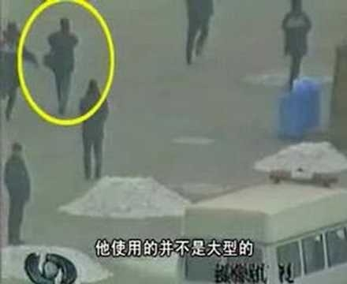
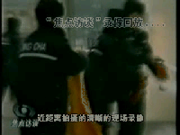

<table>
  <tr>
   <td>
     

   <h4>■ 2001年，在中国大地上，中共对法轮功的迫害正腥风血雨般地展开着。当年的1月23日，在这个家家团圆的除夕夜，天安门广场发生了震惊世界的“自焚”案。中共官方在第一时间宣称事件是法轮功学员所为。虽然各项证据都表明，事件是中共的“自编自演”，但中央电视台等官媒铺天盖地的报导，挑起了民众对法轮功的仇恨情绪。</h4>
     

   <h4> ■ 据人权团体自由之家统计，事件发生后，法轮功学员受到更为严厉的监禁和酷刑，被拘押的法轮功学员在拘押期间死亡人数明显上升，法轮功学员在中国陷入极其艰难的境地。</h4> 

 <h4>   ■ 十几年来，随着越来越多民间质疑的涌现和相关调查结果的曝光，所谓的〝自焚〞真相渐渐被揭开，成为公认的〝21世纪最大伪案〞。下面请看来自各方对事件疑点的分析汇总。</h4>
      

     <b>2001年1月23号除夕，北京天安门广场发生了五人〝自焚〞事件，中共喉舌《新华社》第一时间向全世界声称，自焚者全都是法轮功学员，消息震惊海内外。但中共官方的说法，迅速遭到了大陆民间的质疑。</b>
     

   <b>为什么自焚者王进东面容烧毁，头发和装满汽油的塑料瓶却完好无损？</b> 
  <b>大量警察和急救车是如何在短短几分钟内赶到现场的？</b> 
  <b>警察手中的十多个大型灭火器和〝灭火毯〞从哪里来？</b> 
  <b>为什么要等自焚者喊完口号再盖上〝灭火毯〞？</b> 
  <b>令摄影专业人士关心的是，如此突发、短暂的焚烧镜头，是怎样被及时而又清晰拍下的？不但近景、远景和特写具全，自焚画面还能跟随事件发展。</b> 
  <b>刘思影的母亲刘春玲的死亡，也被舆论质疑是遭重击打死而不是烧死。</b> 
 <b>12岁小女孩刘思影，做了气管切开，居然还能发出这么清脆的声音，还唱歌。不符合医学常识。</b> 
(做气管切开发声是非常困难的)
 
  <b>刘思影，大面积烧伤，身体裹得紧紧的，不符合医学常识。</b> 
  
 (大面积烧伤病人，她的创面，要尽量的暴露，为什么呢？因为如果你裹得太严实了，护士换药、清创非常的麻烦而且很容易造成创面的化脓感染。)

   

  <h4> ■《追查国际》发言人汪志远指出，多项调查证据表明，〝天安门自焚伪案〞，是中共江泽民当局策划的构陷法轮功的阴谋。 
   
   </td>
  </tr>
  </table>
 

 

 

         

2002年1月，北美中文电视台“新唐人”制作了揭露“天安门自焚”真相的影片《伪火》（False Fire），该片从各国参赛的600多部影片中脱颖而出，于2003年11月8日获得第51届哥伦布国际电影电视节荣誉奖，该纪录片揭开了“自焚案”部分漏洞。（大纪元资料室）

 

 
 

 

 

12岁的小姑娘刘思影全身烧伤面积达40%，头、面部四度烧伤，双眼睑外翻，呼吸困难，颜面、双手基本毁损。然而，身受如此重伤的刘思影却仍然能在新华社的报导里与记者对白。中央电视台“天安门自焚案”中的“烧伤病人”全身包裹，记者不穿卫生服，不戴口罩，大胆采访。气管切开手术后，人是绝不可能在这么短时间里恢复讲话能力的。（视频截图）

 

 

天安门自焚伪案中在王进东自焚时，警察拿着所谓的“灭火毯”，却垂在王进东的身后，垂在下面，是在做戏，不是在救“火”。（视频截图）

 

警察晃着灭火毯等镜头，棉衣裤子烧烂，头发还完好，火烧后盛着汽油的塑料瓶完好翠绿。央视女记者承认自焚“摆拍”。

 

 
 

 
澳洲《时代报》（The Age）2004年10月16日的报道对央视的自焚录像做出强烈质疑：“警方事先不知情，却在90秒内，携带大量消防设备出现在画面中。”

  

 
 

 
图中的男子在军警间从容拍摄。国际社会质疑：央视自焚录像有远景、移动拍摄的近景，还有多个自焚者在不同位置的特写，并且录下了声音，显然摄影师做好了准备才能做到的专业拍摄。

  

 
让录像说话：自焚者刘春玲是被警察用重物击打致死的

 

<h2 align=center><a href="https://github.com/sodore/dsdsa/blob/master/video/OwQA4tZUShUeb.mp4?raw=true">“天安门自焚”真相.mp4下載</a></h2>

 <h2 align="center">
<a href="https://git.io/waaa">法轮功明确指出：炼功人不能杀生，自杀有罪</a>
</h2>         
■ 法轮修炼大法是由李洪志先生创编的佛家上乘修炼大法。在李洪志大师的著作《转法轮》中明确指出：“炼功人不能杀生”，李洪志先生还在 《悉尼法会讲法》中指出：“自杀是有罪的。” 真正的法轮功学员不会去自焚。

【明慧网二零一四年一月七日】（明慧评论员文章）法轮功是上乘佛家修炼大法，明文禁止杀生和自杀。任何以自杀、杀生行为诬陷、诋毁法轮功的人，都不敢让人系统地、不带任何观念地、静心地阅读法轮功原著，特别是《转法轮》一书，也不敢让人亲身体验法轮功的功法，因为坏人也知道：很多人都是有良知的，看见真相就不愿再相信谎言。
为了各位的前程，希望大家都来看《是自焚还是骗局》这个十三分钟的录像短片，即便是在百忙之中，很值得看，不看以后可能会非常遗憾！如果能静心通读《转法轮》一书，就更好。

中共就是中共，本性绝不会改变，就如同狼绝不会变成狗或者羊。十三年前的“天安门自焚”骗局虽然早已被揭穿，但命令烧书、禁书的那些中共罪人，总是在寻找欺骗更多人的机会，想多拉一些人陪绑，其中包括海外出于各种目的想和中共走近的人，并借此延缓中共被治罪的那一天的到来。

历史上对正信的迫害从来就没有成功过，现在中共对法轮功“真善忍”真理的迫害更是从一开始就注定了失败。从1999年7月至2014年1月，这场对法轮功的政治迫害已持续十五年了，法轮功学员在中国大陆和平、理性的反迫害言行，通过海外明慧网对迫害黑幕的揭露，也持续十五年了，迫害行为赖以藏身的主要场所——劳教所已经解体，迫害走入末路之末。在这种情况下，又有人到海外拿自焚骗局作招牌，象开假面舞会似的演戏，这一次，目的是骗谁呢？

自焚真相是本世纪重大信息。知道才能心明眼亮，明白才有未来、有光明、有希望。

相关历史概要：

1）法轮功是佛家上乘修炼大法，以《转法轮》一书教人按“真善忍”做好人、提高道德境界，并辅以五套动作优美缓慢的功法。从1992年5月公开传出，至1999年7月，短短七年间，学炼法轮功的人数已高达一亿；因祛病健身、回升社会道德的显著功效，法轮功在中国的声誉家喻户晓。

2）1999年6月，中共专门为迫害法轮功而成立了权力凌驾于公检法之上的“610办公室”。

3）1999年7月，中共首恶江泽民、罗干出于妒嫉和个人利益，发动了对法轮功的全面迫害。但当时，中国大陆有太多的人都经历过“文化大革命”，也都知道法轮功的功效，所以对这场政治迫害不以为然，对政府发动的“百万签名声讨法轮功”等活动消极对待。同时，大批法轮功学员自发地走向北京信访办、天安门广场，为法轮功说公道话。

4）江泽民发布的密令中，最臭名昭著的是对法轮功“名誉上搞臭，经济上截断，肉体上消灭”、“往死里打，打死算自杀”、“打死不查身源，直接火化”。

5）为维持和广泛推动这场迫害法轮功运动，2001年1月23日，江泽民、罗干之流，在天安门广场推出了一场自导自演的自焚事件，并动用全中国的媒体，用这场伤天害理、残害生命的黑戏，嫁祸法轮功。

6）“天安门自焚”骗局推出一周后，人们疑问重重。于是中共操控中央电视台，推出了一个以自焚为题的“焦点访谈”节目，攻击法轮功。然而通过对“焦点访谈”的录像进行慢镜头播放和分析，人们却发现了更多的漏洞。比如，在这场事件中当场失去性命的刘春玲，不象被焚烧致死，而是被突然来自脑后的重物击打致死，而神秘的击打者是军警模样。中央电视台的自焚画面中还有王进东的现场大特写，一名警察站在他的身边，拿着灭火毯，悠闲地等着王进东喊口号，然后机械地把灭火毯盖在王的头上。“王进东”浑身衣服被烧得七零八落，可是他两腿中间装汽油的绿色塑料雪碧瓶却完好无损。

7）法轮功是佛法修炼，禁止杀生和自杀。1995年出版的法轮功主要著作《转法轮》〈第七讲〉中专门有“杀生问题”一节，其中写道：“杀生这个问题很敏感，对炼功人来说，我们要求也比较严格，炼功人不能杀生。”1996年法轮功创始人李洪志先生在《悉尼法会讲法》时，当有弟子问，“杀生是一种很大的罪业，一个人他自杀算不算罪呢？”李先生回答：“算罪。……所以自杀是有罪的。”

8）尽管江罗监制的自焚事件漏洞百出，但想在政治上捞票的人，常年将此伪案和骗人用的“标准答案”塞入中国大陆中小学校的教科书、考试题、招工表格，从儿童、青少年学生做起，制造对法轮功的恐惧和仇恨。

<h2 align="center"><a href="https://git.io/ykkk">自焚伪案：原来不止是演戏，真的在杀人放火</a></h2>    

【明慧网二零一二年三月二十八日】因为要保护这位讲真话的世人，所以称之为贾姐，贾姐当时是某市团委的负责人，二零零一年罗干导演天安门自焚，栽赃构陷法轮功时，在摆道具的时候，正式拍摄前，她在天安门现场。

她说：当时看到一伙人忙忙活活的，还以为是拍电视。她没有在意就离开了，离京前并不知道发生了什么事。直到正月初八，全国铺天盖地的播放自焚伪案，挑动仇恨时，她才明白过来：原来不止是演戏，真的在杀人放火。

几年后遇到修炼法轮功的同学向其讲述真相时，她说出来的，而且说：她不会相信造谣的谎言，因为她亲眼看到了。

<h2 align="center"><a href="https://git.io/ykkk">刘春玲邻居揭露自焚伪案</a></h2>  
【明慧网2006年5月16日】我是一个女大法弟子，2006年5月12日，我去开封谈生意，对方也是位女士，自然说话随便多了。一会儿，我将话题转到了讲真相上，当说到“天安门自焚伪案”时，没想到对方竟然和那个被打死的刘春玲是近门邻居，她滔滔不绝的向我讲了刘春玲的一些情况和生活中的行为。

她说：“刘春玲是外地人，和丈夫离婚后带着母亲（继母）和女儿思影到开封生活，平常打工或者干些零活挣钱维持，生活很拮据。由于感情和生活上的压力，她脾气时好时坏，发作时常常打骂思影发泄。邻居们既可怜她一家，更可怜那受苦的孩子。有一次，是夏天，春玲又发脾气打孩子，毒辣辣的太阳她竟然罚思影到院里暴晒，我当时看不过，就拉着思影说，回屋里去吧，你妈妈不打你了。可是没有春玲允许，思影还是傻傻的在太阳下不敢回屋。”

“后来，几天不见她母女，电视里却说她们去天安门自焚了，而且还是个炼法轮功的，真是可笑，我和春玲住那么近，一天不知要见多少次面，从来没有见过、也没有听说过她炼法轮功，那时候法轮功在我们开封几乎是家喻户晓，我们苹果园区就有，那些老太太大清早的听着录音机炼功，路旁都有，却从没有见春玲去炼。再说了，春玲当时生活都顾不着了，哪有闲心去炼功啊。所以这个什么自焚在我们那个居住区都知道是假的，春玲是被人骗了，被人害了，真可怜。”

“还有一件事更让人怀疑，大概是自焚后的几天（记不清了），警察去春玲家搜查，我和那几家邻居都在场，大家都很惊奇的是，警察从春玲屋里搜出了十多万现金（估计），都是壹佰元成捆的。在场的邻居都议论纷纷，春玲这么穷，哪来那么多钱，平常吃穿都俭省的很，居然在家里放了这么一大堆现金。现在想想，那可能就是春玲母女的卖命钱啊。人被骗了，被不明不白的整死了，脏钱又被党拿走了，这才是吃人不吐骨头啊。”

<h2 align="center"><a href="https://git.io/3f">“天安门自焚伪案”是610恐怖组织策划</a></h2>  

【明慧网2005年1月29日】因我曾被非法关押在马三家教养院，2001年才回来的，有一天我的一个比较要好的工友对我说，他有一朋友在本市“610”工作，还是一个负责人，他个人想见见我，了解在马三家的一些情况。我当时就答应他。

一天这“610”负责人就到我家来，因为是工友介绍来的，他又不代表组织，所以我们谈话很随便。当谈到自焚时，他无意中说出：“通知我们前两天自焚，后来又往后拖了两天才自焚。”我当时也没有反应出来是什么意思。现在想起来，自焚原来是“610”办公室一手炮制的。从上到下贯彻下来的，是他们早就布置好的，有计划、有目地的栽赃陷害法轮功。所以说现场有灭火器一点也不奇怪。假如说自焚事件是真实的突发事件，他们不会主动去告诉“610办公室”的人：什么时间自焚。这就是为什么“天安门自焚”是漏洞百出，疑点重重，假象处处暴露。

因为我看到的一些有关“自焚”的材料没提到这个事，这件事是我自己亲自听到的，所以就补充这一点，让世人能从谎言中猛醒。

<h2 align="center"><a href="https://git.io/ykkk">一场世纪伪火“烧”出中共原形</a></h2> 

【大纪元2014年01月15日讯】（正见网报导）2001年1月23日（除夕），天安门广场上来了7个人，有5人身上突然燃起火来——这就是震惊国际社会的世纪伪案“天安门自焚事件”，其中有一名女子当场死亡。数日后，她的女儿也在医院离奇猝死。在中共喉舌媒体的报导中，称这些人是“法轮功学员”。该事件发生后，中共对法轮功学员的打压不断升级。

事后，新唐人电视台根据此案的现场录像制作出一部影片《伪火》，还原天安门伪“自焚”事件的真相，该片曾在国际社会获奖。

2001 年8 月14 日，国际教育发展组织在联合国会议上明确指出，“天安门自焚”是中共一手导演的，是对法轮功的构陷。当时在场的中共代表面对确凿的证据哑口无言。

假的就是假的。这场伪火案从哪个角度看都有破绽：从摄像角度看，远镜头、近镜头、特写镜头等，而且还非常清晰，除非都是准备好的，否则，突发事件怎么可能准备的这么完美？！从医学角度看，烧伤病人要裸露，不能包扎，而电视上显现出是包扎的一层又一层；切开的喉咙会唱歌；严重烧伤的人还会喊出清晰的“妈妈”声。从生活常识看，警察还背着灭火器去巡逻，要不，怎么瞬间就出现那么多的灭火器？！从新闻角度、央视新闻审查制度角度等等都能看出破绽。

为什么要造假诬陷？就是因为法轮功太正了，找不到一点不好的地方。法轮功，又称法轮大法，是由李洪志先生于1992 年5月传出的佛家上乘修炼大法，以“真善忍”为根本指导，包含五套舒缓优美的功法动作。法轮功教人向善，要求修炼者从做好人做起，努力按照“真善忍”的要求提 升道德标准。修炼法轮功不但能祛病健身，还能使人变得诚实、善良、宽容、平和。

1998 年，国家体育总局对3万多名法轮功学员做了5 次医学调查，表明法轮功祛病健身有效率高于98% 。同时，前人大的老干部也做了详尽的调查，得出“法轮功于国于民有百利而无一害”的结论，并向中央做了书面汇报。如果允许大法弟子公开讲述修炼法轮功的感受，每个人的修炼经历足以打动世人。

正因为法轮功太正了，照出了社会中的一切不足，包括依靠谎言与暴力欺骗与压榨人民的中共。法轮功讲“真、善、忍”，把中共的“假、恶、斗”暴露了出来，就是这样，法轮功讲修炼，不讲政治，你中共的好与坏与修炼没有任何关系。但是，中共毕竟是一个十恶俱全的邪灵，明知法轮功没有过错，法轮功的传出“于国于民有百利而无一害”，但是，当时的总书记江xx变态狂妄的心理与中共邪灵相合，就不断的制造事端，大法弟子就抱着大善大忍的胸怀向各级政府讲述法轮功真相，争取一个学法炼功的自由环境。

在江氏流氓集团的有计划的预谋下，于1999年7月20日，失去理智的倾一国之力，开足了马力针对善良无辜的法轮功群众实行群体灭绝式的残酷迫害。 江xx狂妄的叫嚣“三个月内消灭法轮功”，然而法轮功在打压中不断的讲真相，使世人越来越明白真相，眼看这场镇压快持续不下去了，江氏流氓集团就炮制出天安门自焚伪案，蛊惑民众，挑起群众仇恨法轮功，使迫害进一步升级。

这场漏洞百出的世纪伪火毒害了无数的众生，同时也“烧”出了中共原形，把中共的邪教本质、流氓本性彻底的暴露出来。

中共是一个外来的邪灵，是西来幽灵。《共产党宣言》开宗明义明确提出：“一个幽灵，共产主义的幽灵，在欧洲游荡。”幽灵，就是俗话说的魔鬼，这个魔鬼“游荡”到中国大陆，给中国带来了无穷的灾难。

中共利用伪装的谎言与暴力窃取政权后，就迫不及待的大搞杀戮，杀地主富农，杀民族资本家，杀知识份子，杀学生，直到今天酷刑迫害法轮功群众；意识形态领域里推行无神论，破坏有着五千年底蕴的传统文化，隔断人与神的联系，同时大力宣扬斗争哲学，“与天斗，与地斗，与人斗，其乐无穷”，强力破坏了人与人之间建立在传统文化基础上的和谐关系，人与人之间变成了斗争关系。中共还用宣誓加入队、团、党的办法，叫人在血旗面前发毒誓，把生命献给邪党，把人紧紧的和邪党捆绑在一起，真的到了清算恶党的时候，这些人就是殉葬品。

人有千算不如天有一算。中共邪党自认为自己的所作所为足以达到毁灭人类的目的，但是法轮功学员的讲真相使更多的民众觉醒了，截至2018年5月，已有三亿中国民众在海外大纪元网站声明退出中共的党、团、队组织，相信“法轮大法好”、“真善忍好”，为自己选择了美好的未来。

特别是从去年到现在，迫害法轮功的帮凶薄熙来、王立军入狱，周永康被抓，李东生落马，善恶报应的天理已经指向了迫害的始作俑者，揭开了大清算的序幕。有句话叫“不拿住奸贼不散戏”，正义终将战胜邪恶，历史上迫害佛法修炼的都是在可耻中收场。

（责任编辑：李文慧）

<a href="https://git.io/waaa">中国大陆法轮功学员不畏艰险、冒着被抓捕关押的危险，把“自焚真相”影像、文字资料传播给民众，人们在见到炼法轮功的亲戚朋友时，更要问个究竟，多少人自叹：“又被共产党骗了！几十年来它哪次说过真话？！”
 

央视等官媒反复播出的自焚现场、自焚者惨不忍睹的颜容和他们凄惨的声音，强烈地冲击了人们的视觉，一时间让很多人对法轮功心怀恐惧。随着真相的慢慢揭开，并在法轮功学员长期广泛的传播真相活动中，人们从中共自编自演的这一场惨案看清了中共的残暴本质，也有很多人在明白真相后声明退出中共的党、团、队组织，抛弃中共。</a>

